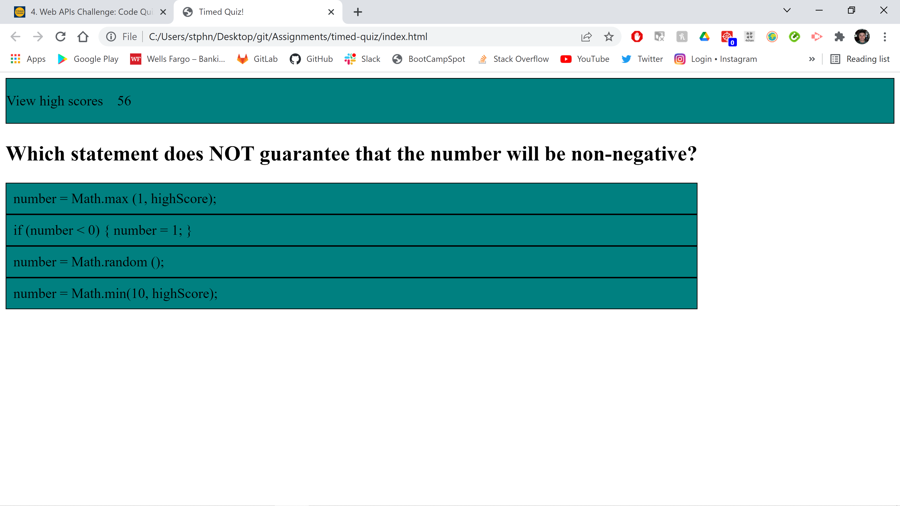

# timed-quiz

## Description
In this week's challenge we were tasked with created a timed quiz. In this quiz questions appear one after the next once the timer begins and questions are answered. When questions are answered incorrectly, the user gets a time penalty. This challenge also requires us to store and retrieve user scores on localStorage.

## Credits
StephenWDickey
GitHub page: https://github.com/StephenWDickey
Deployment URL:

Joseph Jepson - Coding Bootcamp tutor
